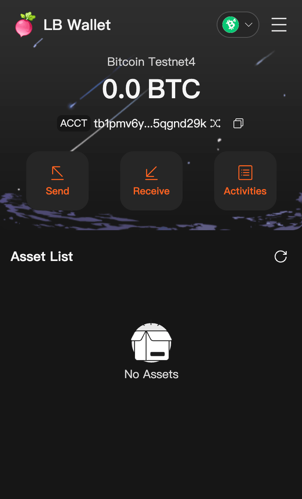

# Browser Extension Wallet

This is an open source browser extension wallet supporting both Ethereum and Bitcoin.

The wallet is developed based on `ethers` and `bitcoinjs-lib`, with all network configurations customizable by users. Moreover, this program does not collect any local data.



## Download

[Download Wallet](https://github.com/luban-wallet/extension-app/releases)

## How To Use

1. Download the latest version of wallet above and unzip

2. Open the browser extension center

3. Enable developer mode

4. Load the decompressed extension program in step 1

5. Enjoy it

## Local Debug

> Note: wallet password in debug mode must be `dev`

1. Install dependencies

```bash
yarn workspace @luban/wallet-app install
```

2. Run

```bash
yarn workspace @luban/wallet-app dev
```


## Error Codes

| Code | Description |
|-|-|
| 4000 | Not support |
| 4001 | User reject |
| 4002 | Account not connected |
| 4004 | Address mismatch |
| 4006 | Processing another request |
| 4007 | Wallet error |

## Layering

| Layer     | Purpose             |
| --------- | ------------------- |
| 0-1999    | Page Element Layout |
| 2000-2999 | Dialogs             |
| 3000-3999 | Component Popups    |
| 4000-4999 | Toast               |

